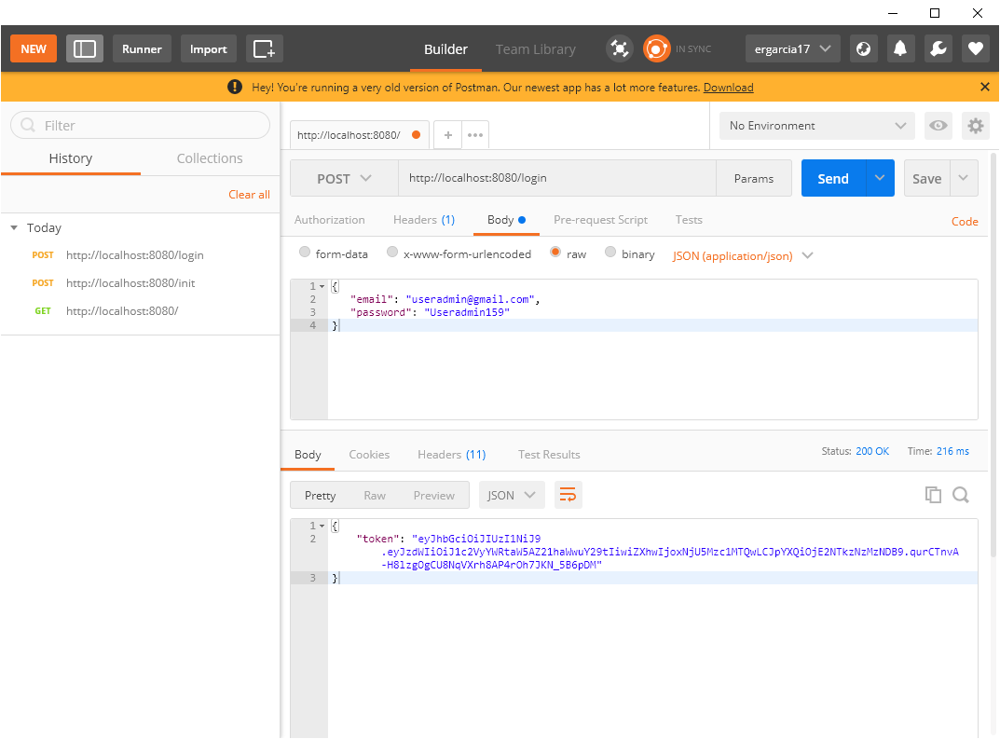

# Api Usuario

#### Evaluación Java, Ing. Erania García

Desarrollar una aplicación que exponga una API RESTful de creación de usuarios.

### Framework / Tecnologías implementadas

* Spring Boot Web
* Spring Boot Security
* Spring Boot JPA (Hibernate)
* JWT (Json Web Token)
* Swagger
* Lombok
* HSQLDB
* Mockito
* Maven
* Java 8

### Guía de Usuario

#### Requerido

* Java 8
* mvn
* git
* Intellij o el IDE de preferencia

#### Ejecutar el proyecto

1. Clonar

 ```bash
   git clone https://github.com/EraniaG/userApi.git
   mvn clean package install
 ```

2. Ejecutar

 ```bash
   cd apiUser\target
   java -jar userApi-0.0.1.jar
 ```

3. Consumir API

* Desde un navegador web o utilizar Postman para entrar a la url http://localhost:8080/
  

  

  
* Crear usuario Admistrador: (POST) http://localhost:8080/init
  

  
  

* Iniciar sesión: (POST) http://localhost:8080/login
   ```bash
  {
      "email": "useradmin@gmail.com",
      "password": "Useradmin159"
  }
   ```
 

  
  

* Una vez que inicia sesión, se le asigna un token al usuario que le permite consumir los otros recursos. El token
  asignado persiste junto con el usuario. Debe copiar dicho token ya que lo necesitará para realizar las otras peticiones.
  

* Para realizar peticiones a los paths que necesita autenticación y autorización, debe agregar 
  un Header de tipo Authorization cuyo valor será "Bearer" + " " + "token"
  

  
  

* Obtener catálogo de usuarios (Necesita Header de tipo Authorization): (GET) http://localhost:8080/user/list
  
  
  


* Registrar usuario (Necesita Header de tipo Authorization): (POST) http://localhost:8080/user/save
   ```bash
      {
        "name": "usertest",
        "email": "usertest@gmail.com",
        "password": "Usertest852",
        "phones": [
		{
			"number": "888888",
			"citycode": "3",
			"countrycode": "23"
		}
	]
      }
   ```
  

  
  
  
* Modificar usuario (Necesita Header de tipo Authorization): (PUT) http://localhost:8080/user/{prId}
   ```bash
      {
        "name": "usertestchange",
        "password": "Usertest8520",
        "phones": [
		{
			"number": "888881",
			"citycode": "3",
			"countrycode": "23"
		}
	]
      }
   ```
  

  
  

* Desactivar usuario (Necesita Header de tipo Authorization): (PUT) http://localhost:8080/user/desactivate/{prId}
  

  
  
  
* Activar usuario (Necesita Header de tipo Authorization): (PUT) http://localhost:8080/user/activate/{prId}
  

  


### Documentación Swagger

* Ver documentación (Necesita Header de tipo Authorization): (GET) http://localhost:8080/v2/api-docs


  

